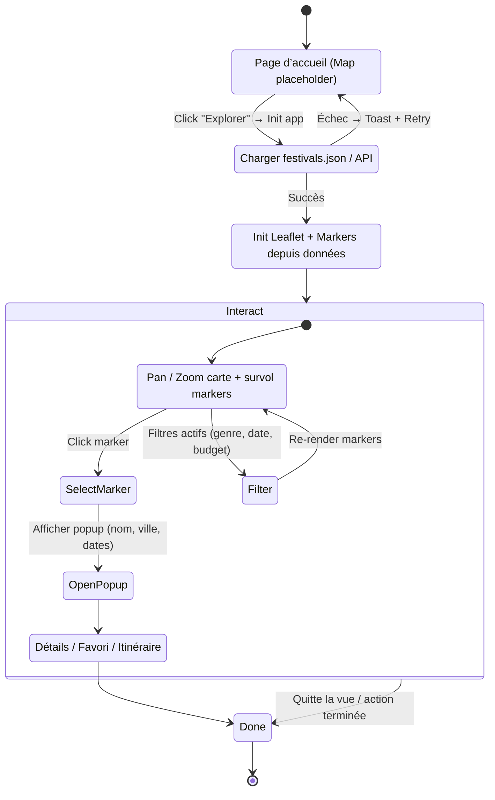

# Activity Diagram — FestMap

Ce diagramme décrit le flux principal de l’application côté front (Angular) pour la navigation sur la carte des festivals.

```mermaid
stateDiagram-v2
  direction TB

  [*] --> Home
  Home: Page d’accueil (Map placeholder)
  Home --> LoadJSON: Click "Explorer" → Init app

  LoadJSON: Charger festivals.json / API
  LoadJSON --> RenderMap: Succès
  LoadJSON --> Home: Échec → Toast + Retry

  RenderMap: Init Leaflet + Markers depuis données
  RenderMap --> Interact

  state Interact {
    direction TB
    [*] --> Browsing
    Browsing: Pan / Zoom carte + survol markers
    Browsing --> SelectMarker: Click marker
    SelectMarker --> OpenPopup: Afficher popup (nom, ville, dates)
    OpenPopup --> SecondaryAction

    Browsing --> Filter: Filtres actifs (genre, date, budget)
    Filter --> Browsing: Re-render markers
  }

  SecondaryAction: Détails / Favori / Itinéraire
  SecondaryAction --> Done

  Interact --> Done: Quitte la vue / action terminée
  Done --> [*]
```