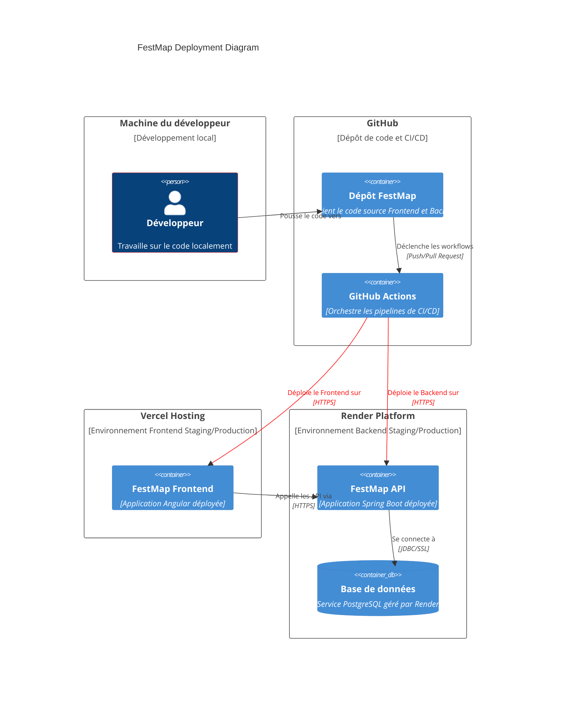

```mermaid
C4Deployment
    title FestMap Deployment Diagram

    Deployment_Node(developer_machine, "Machine du développeur", "Développement local") {
        Person(developer, "Développeur", "Travaille sur le code localement")
    }

    Deployment_Node(github, "GitHub", "Dépôt de code et CI/CD") {
        Container(repo, "Dépôt FestMap", "Contient le code source Frontend et Backend")
        Container(github_actions, "GitHub Actions", "Orchestre les pipelines de CI/CD")
    }

    Deployment_Node(vercel, "Vercel Hosting", "Environnement Frontend Staging/Production") {
        Container(frontend_app, "FestMap Frontend", "Application Angular déployée")
    }

    Deployment_Node(render, "Render Platform", "Environnement Backend Staging/Production") {
        Container(backend_api, "FestMap API", "Application Spring Boot déployée")
        ContainerDb(render_db, "Base de données", "Service PostgreSQL géré par Render")
    }

    Rel(developer, repo, "Pousse le code vers")
    Rel(repo, github_actions, "Déclenche les workflows", "Push/Pull Request")

    Rel(github_actions, frontend_app, "Déploie le Frontend sur", "HTTPS")
    Rel(github_actions, backend_api, "Déploie le Backend sur", "HTTPS")

    Rel(frontend_app, backend_api, "Appelle les API via", "HTTPS")
    Rel(backend_api, render_db, "Se connecte à", "JDBC/SSL")

    UpdateElementStyle(developer, $borderColor="#ff0000")

    UpdateRelStyle(github_actions, frontend_app, $textColor="#ff0000", $lineColor="#ff0000")
    UpdateRelStyle(github_actions, backend_api, $textColor="#ff0000", $lineColor="#ff0000")

```