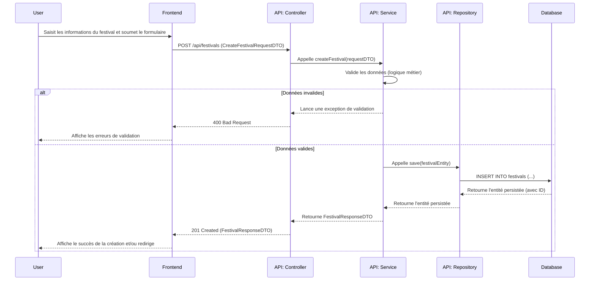

```mermaid
sequenceDiagram
    participant User
    participant Frontend
    participant APIController as API: Controller
    participant APIService as API: Service
    participant APIRepository as API: Repository
    participant Database

    User->>Frontend: Saisit les informations du festival et soumet le formulaire
    Frontend->>APIController: POST /api/festivals (CreateFestivalRequestDTO)
    APIController->>APIService: Appelle createFestival(requestDTO)
    APIService->>APIService: Valide les données (logique métier)
    alt Données invalides
        APIService-->>APIController: Lance une exception de validation
        APIController-->>Frontend: 400 Bad Request
        Frontend-->>User: Affiche les erreurs de validation
    else Données valides
        APIService->>APIRepository: Appelle save(festivalEntity)
        APIRepository->>Database: INSERT INTO festivals (...)
        Database-->>APIRepository: Retourne l'entité persistée (avec ID)
        APIRepository-->>APIService: Retourne l'entité persistée
        APIService-->>APIController: Retourne FestivalResponseDTO
        APIController-->>Frontend: 201 Created (FestivalResponseDTO)
        Frontend-->>User: Affiche le succès de la création et/ou redirige
    end
```